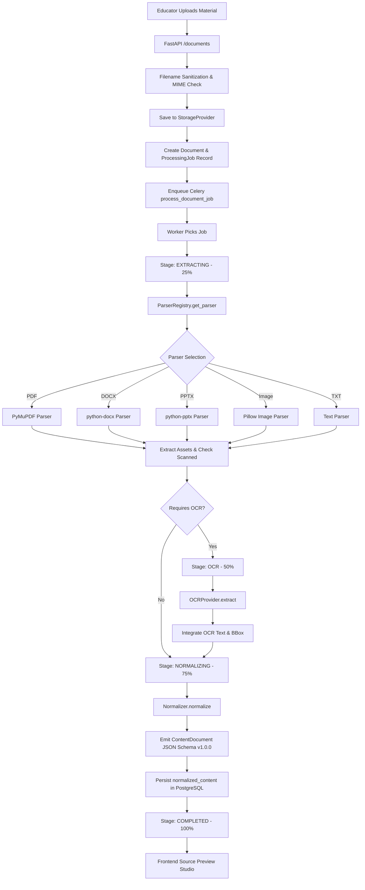

# AccessLearn AI — System Architecture Specification

## Overview

AccessLearn AI transforms raw, heterogeneous educational materials into structured, accessible, multi-modal formats. The platform uses a modular monolith architecture built around a **Normalized Content Intermediate Representation** (`ContentDocument`), decoupling format-specific extraction from downstream accessibility adaptations.

---

## Phase 2 Extraction & Normalization Flow



---

## The Normalized Content JSON Specification (`ContentDocument`)

All formats normalize into the common schema defined in `backend/app/schemas/content.py`:

```json
{
  "schema_version": "1.0.0",
  "id": "c71a3994-2790-482a-a5f1-326ea02e86c0",
  "title": "Photosynthesis and Cellular Respiration",
  "source_language": "en",
  "subject": null,
  "grade_hint": null,
  "learning_objectives": [],
  "glossary": {},
  "sections": [
    {
      "id": "sec_01",
      "title": "Page 1: Introduction",
      "blocks": [
        {
          "id": "blk_01",
          "type": "heading",
          "source_text": "Overview of Cellular Energetics",
          "source_asset_id": null,
          "page_or_slide": 1,
          "metadata": {
            "heading_level": 1,
            "bbox": [50.0, 70.0, 480.0, 100.0],
            "source_type": "pdf",
            "order": 1
          },
          "accessibility_annotations": {}
        },
        {
          "id": "blk_02",
          "type": "paragraph",
          "source_text": "Photosynthesis converts solar light into chemical bond energy.",
          "source_asset_id": null,
          "page_or_slide": 1,
          "metadata": {
            "bbox": [50.0, 110.0, 520.0, 150.0],
            "source_type": "pdf",
            "order": 2
          },
          "accessibility_annotations": {}
        }
      ]
    }
  ]
}
```

### Traceability Guarantee
Each block maintains:
1. **Stable UUID**: Identifies the block across pipeline transformations.
2. **Page or Slide Reference**: `page_or_slide` tracks exact physical location.
3. **Bounding Box**: `bbox: [x0, y0, x1, y1]` coordinates for visual verification.
4. **Asset Reference**: `source_asset_id` links to private binary image files stored in `StorageProvider`.

---

## Error & Failure Handling

1. **Corrupted or Password-Protected Documents**:
   The parser detects invalid signatures or encryption, transitions `job.status = "FAILED"` and `document.extraction_status = "FAILED"`, and returns explicit actionable error messages.

2. **Non-Fatal Warnings**:
   Low OCR confidence, partial image extraction issues, or uncertain table grids are stored under `document.extraction_warnings` and rendered in the frontend warning banner without aborting document ingestion.
